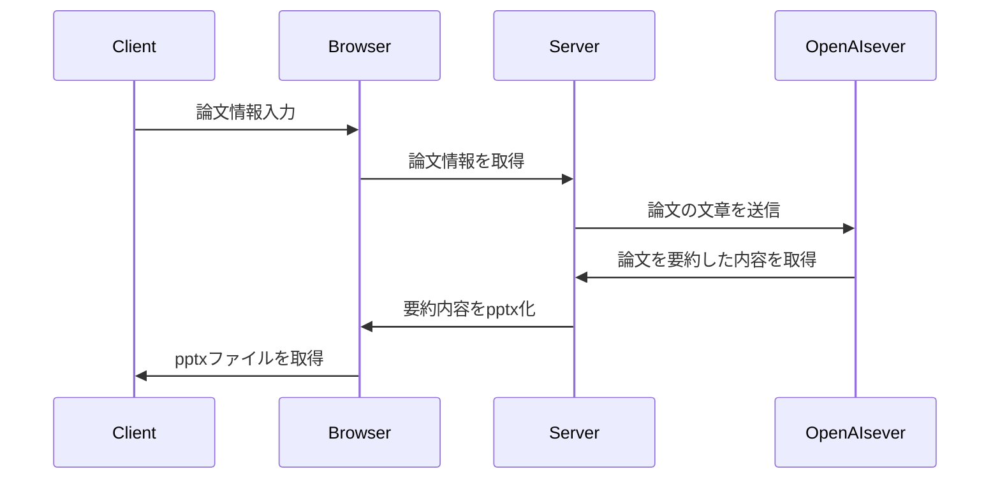

# 設計詳細

## ユーザーゴール
論文の内容を要約し、パワーポイントにしてダウンロードできる。

## 機能要件
- 論文の内容を入力できる。
- 論文の要約をパワーポイントでダウンロードできる。

## シーケンス図の詳細
1. ブラウザに論文を入力(pdf)
2. ブラウザからサーバーに論文の内容が渡される
3. サーバーがpdfから文字を起こす。
4. サーバーからOpenAIサーバーでChatGPTに要約させる
5. OpenAIサーバーからの返り値をServerで受け取り、パワーポイントを作成
6. 作成したパワーポイントを出力

###　追加
パワーポイントで出力した内容を修正したい。
履歴を取る。
Firebaseで認証を簡単にやってくれる. Flask*Firebase
Flask: https://qiita.com/usaitoen/items/0184973e9de0ea9011ed

## シーケンス

## 状態遷移図
